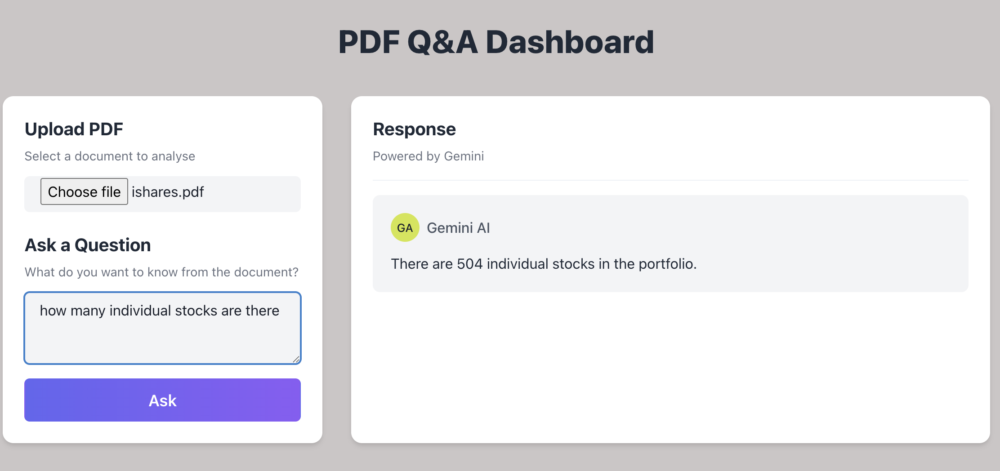

# Financial Report Chatbot

An interactive full-stack application that allows users to upload PDF-based financial reports (e.g., ETF fact sheets) and ask natural-language questions about them. Built with:

- LangChain + Vertex AI Gemini for Retrieval-Augmented Generation (RAG)
- FastAPI backend for PDF processing and agent orchestration
- React + Chakra UI frontend for a seamless chat interface

---

## Demo

Upload your PDF → Ask a question → Get a direct answer from the document  


---

## Architecture Overview

React + Chakra UI (Frontend)
        ↓
FastAPI (Backend API)
        ↓
LangChain Agent
  ├─ RAG (PDF Q&A via Chroma Vectorstore)
  ├─ Calculator Tool
  └─ Summarizer Tool
        ↓
Chroma Vectorstore (stores PDF chunks)
        ↓
Vertex AI
  ├─ Embeddings: text-embedding-005
  └─ LLM: Gemini 2.5 Flash Lite

---

## Features

- PDF upload and parsing via PyMuPDF
- Document chunking and semantic vector search with ChromaDB
- Retrieval-augmented QA using Gemini 2.5 Flash Lite
- Calculator and summarizer toolchain integration
- Clean and responsive dashboard UI via Chakra UI
- CORS-ready and extensible for production

---

## Technologies Used

| Layer         | Stack                                             |
|---------------|--------------------------------------------------|
| Frontend      | React (TypeScript), Vite, Chakra UI              |
| Backend       | FastAPI, Uvicorn, LangChain                      |
| LLM           | Gemini 2.5 Flash Lite via Vertex AI              |
| Vector Store  | ChromaDB                                         |
| Embeddings    | Vertex AI `text-embedding-005`                   |
| PDF Parsing   | PyMuPDF (`fitz`)                                 |

---

## Installation & Setup

### 1. Backend

```bash
cd app
python -m venv venv
source venv/bin/activate
pip install -r requirements.txt

# Add your GCP credentials and set up Vertex AI access
export GOOGLE_APPLICATION_CREDENTIALS="path/to/your/credentials.json"

uvicorn app.main:app --reload
```
### 2. Frontend
```bash
cd frontend
npm install
npm run dev
```

Powered by LangChain & Google Cloud Vertex AI

